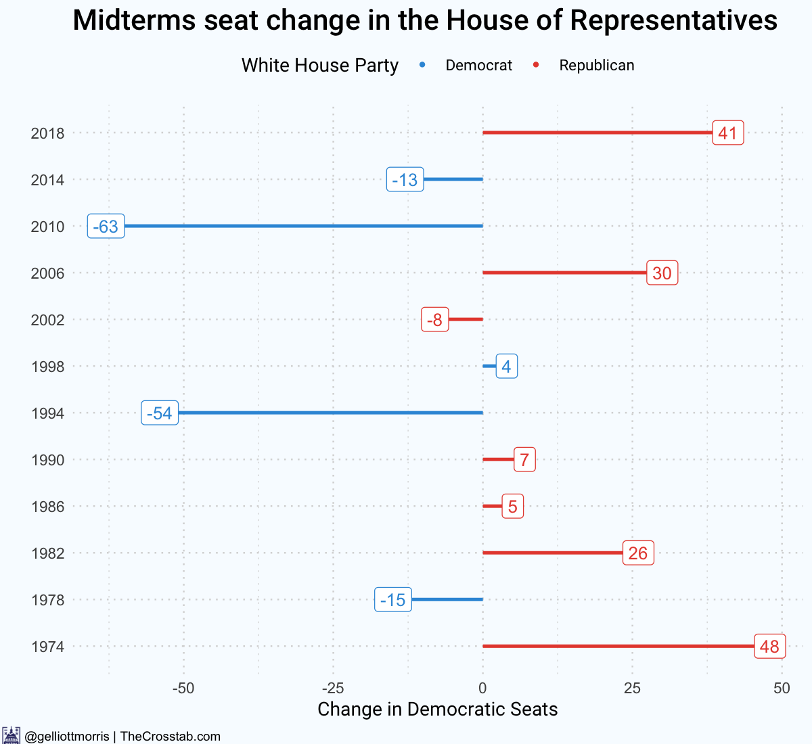
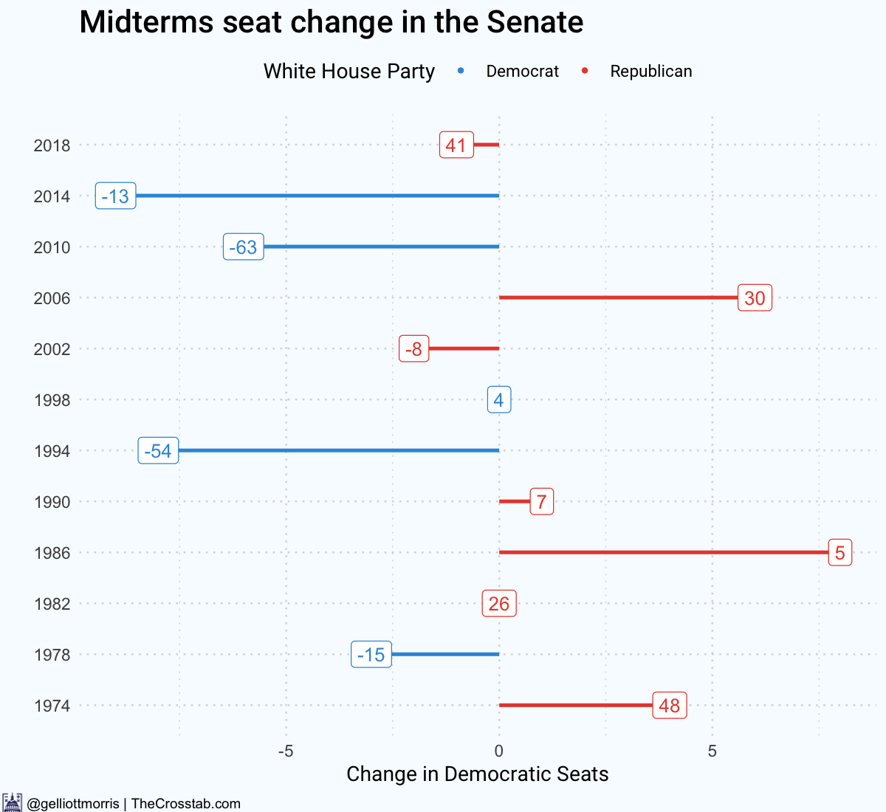
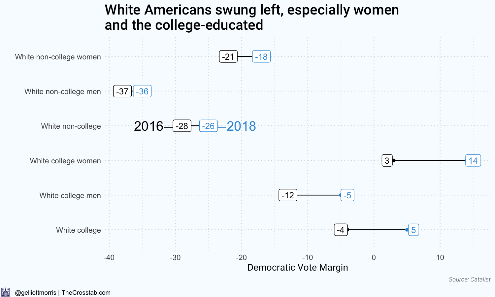
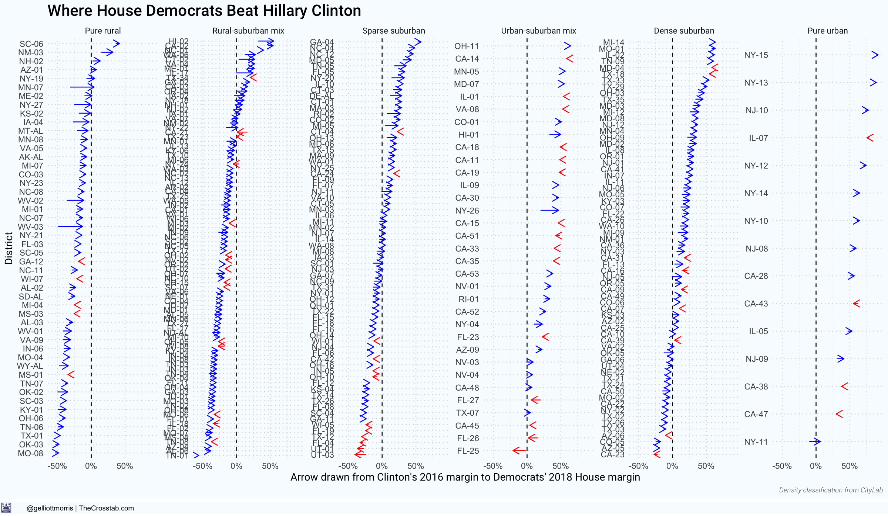
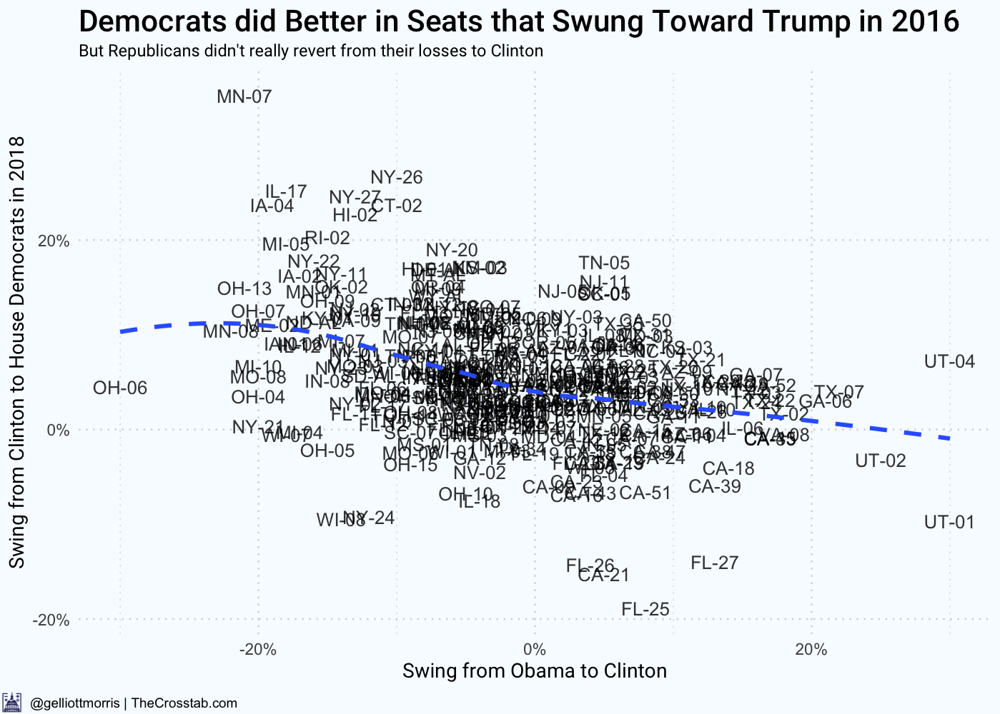
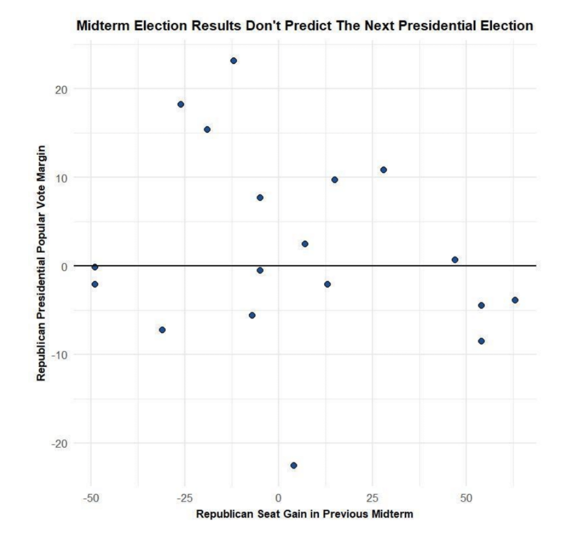

```{r include=F}
#source("figures.R")
library(tidyverse)
library(knitr)
library(kableExtra)

knitr::opts_chunk$set(echo=F,warning=F,message=F)

```

class: two-column

# The 2018 Midterms and 2020

Some framing:

.pull-left[ 

2018: a blue wave


]

.pull-right[

2020: ```¯\_(ツ)_/¯ ```


]

Though we know a lot already about what happened in the 2018 midterms, there's a lot we can't know about 2020 until we get closer.

---

# The 2018 Midterms


We have three big questions...


1. What did we expect?


2. What happened?


3. Why?


---

# 2018: Expectations

(For the House of Representatives)

Method: 


1. Predict the national popular vote with generic ballot polls and the average swing in US House special election


2. Add the swing in the national popular vote to seat-level fundamentals forecast and combine with district-level polling


3. Simulate the election 50,000 times to account for the uncertainty in the various hierarchical forecasts

<br />

Refer to (Bafumi et. al., 2014) for the conceptualization of distilling national information to the district level and (Bafumi et. al. 2018) for pre-election forecasts of the 2018 midterms and (Morris 2018) for the addition of district-level polling averages, obtained by aggregating data from public sources, and first round election results (only in CA and WA) using Bayesian precision weighting (Morris, 2018).


---

# 2018: Expectations

Predictions:

- Final pre-election forecast: Democrats win an average of 233 (D+39) seats (81% chance of a majority) with a popular vote margin of 8.8 pts.


This program can be run as far out from the election as we want....


- Prediction in January 2018 (the high point of Democrats' generic ballot advantage): Democrats win am average of 242 seats (90% chance of a majority) with a popular vote margin of 9.4 pts.
- Prediction in July 2018 (the low point): Democrats win an average of 234 seats (75% chance of a majority)  with a popular vote margin of 8.8 pts.


---

# 2018: Results


.pull-left[ 

]

.pull-right[

]


_*The election in North Carolina's 9th Congressional district has yet to be resolved._

---

# 2018: Why?

1. Midterm elections are a referendum on the president. It is not atypical for the party in the White House to lose a significant number of seats; the average loss since 1970 is 24 in the House. This is well-founded in the political science literature (Tufte, 1975; Erikson, 1988; Campbell, 1991; Jacobson, 2007; etc.).

2. This year, the Republican majority was exposed by competetive seats, largely concentrated in suburban areas

3. Whites and college-educated voters, who are much more likely to populate those areas, swung hard to the left

4. But a mix of high-turnout among college-educated voters and liberals, salience of Democrat-dominated issues like health care, and overall higher loyalty to downballot Democrats than Hilalry Clinton helped them outperform in rural areas

---

# White Women Fled the GOP





---

# The Nationalization of politics

House outcomes are aligning with the presidency: Democrats flipped 87% of GOP-held districts that Clinton won...


.pull-left[
```{r echo=F}
house <- read.csv("data/house_master.csv")

house %>%
  filter(clinton.margin.2016>0,dem.house.margin.2016<0) %>%
  mutate(dem.house.margin.2018 = round(dem.house.margin.2018*100,1)) %>%
  select("Seat" = district,"Dem. Margin" = dem.house.margin.2018) %>%
  head(12) %>% kable()

```
]

.pull-left[
```{r echo=F}
house <- read.csv("data/house_master.csv")

house %>%
  filter(clinton.margin.2016>0,dem.house.margin.2016<0) %>%
  mutate(dem.house.margin.2018 = round(dem.house.margin.2018*100,1)) %>%
  select("Seat" = district,"Dem. Margin" = dem.house.margin.2018) %>%
  tail(12)  %>%
  kable()

```
]


---

# The Nationalization of politics

... but Democrats also did well in seats Trump won, winning 83% of them.


```{r echo=F}
house <- read.csv("data/house_master.csv")

house %>%
  filter(clinton.margin.2016<0,dem.house.margin.2016>0) %>%
  mutate(dem.house.margin.2018 = round(dem.house.margin.2018*100,1)) %>%
  select("Seat" = district,"Dem. Margin" = dem.house.margin.2018) %>%
  kable()
```


This brings me to my final point: the hidden rural swing. 


---
class: center, middle


# Overlooked fact of the 2018 midterms: Democrats improved on their 2016 performance most in rural areas.


---
# Rural America 




---
# Rural America


Rural areas swung the furthest left from Clinton to Democrats in 2018, but the party still has not overcome a long-term decline since (at least) Obama's re-election in 2012.


```{r echo=F}
house_master <- read.csv("data/house_master.csv",stringsAsFactors = F)

house_master <- house_master %>%
  mutate(density_type = factor(density_type,
                               levels=c("Pure rural","Rural-suburban mix","Sparse suburban","Urban-suburban mix","Dense suburban","Pure urban")))


swing_2016_2018.avg = 
  house_master %>%
  filter(uncontested==0,uncontested_2016==0,!grepl("PA|LA|WV",district)) %>%
  mutate(swing_2016_2018 = mean(dem.house.margin.2018 - clinton.margin.2016)) %>% 
  pull(swing_2016_2018) %>% mean()

swing_2012_2018.avg = 
  house_master %>%
  filter(uncontested==0,uncontested_2016==0,!grepl("PA|LA|WV",district)) %>%
  mutate(swing_2012_2018 = mean(dem.house.margin.2018 - obama.margin.2012)) %>% 
  pull(swing_2012_2018) %>% mean()

house_master %>%
  filter(uncontested==0,uncontested_2016==0,!grepl("PA|LA|WV",district)) %>%
  group_by(density_type) %>%
  summarise(swing_2016_2018 = round(mean(dem.house.margin.2018 - clinton.margin.2016)*100,1),
            swing_2012_2018 = round(mean(dem.house.margin.2018 - obama.margin.2012),1)) %>% 

  as.data.frame() %>%
  select("Density" = density_type,
         "Avg. Swing From Clinton" = swing_2016_2018,
         "Avg. =Swing From Obama" = swing_2012_2018) %>%
  kable()

```


---
# Rural America 

Why did Democrats do so well in rural areas?

Plausible explanations:

- Mean Reversion: Areas that swung hard toward Trump were predisposed to swing back toward Clinton
- Simple outperformance: Plausibly because of the salience of health care policy in the Midwest, Democrats did better than their Republican challengers


---
# Rural America 





---

# What 2018 forecasts for 2020:

There's no relationship between midterm seat loss and swing in presidential vote share.




_Figure Courtesy of David Byler, WaPo_


---

# Thank you

**Email: [elliott@thecrosstab.com](mailto:elliott@thecrosstab.com)**

**Twitter: [@gelliottmorris](http://www.twitter.com/gelliottmorris)**

**Find these data on Github: [github.com/elliottmorris](http://www.github.com/elliottmorris)**


